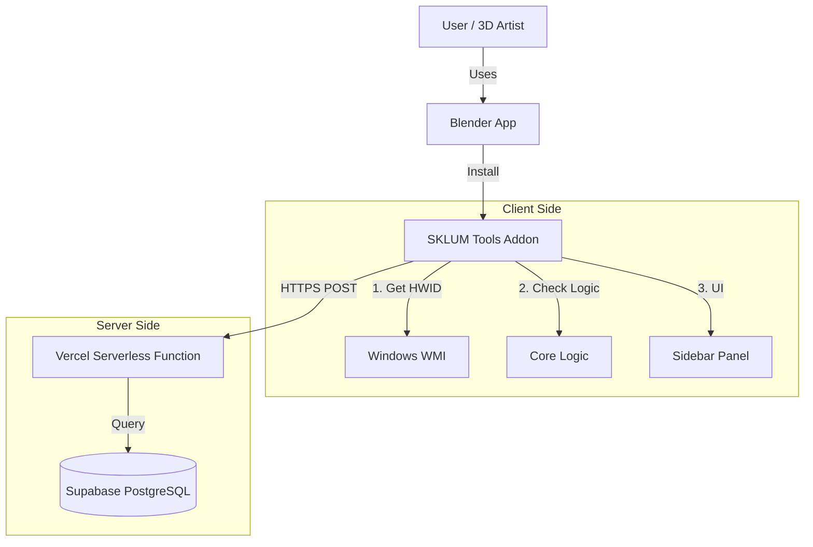

# System Architecture

## High-Level Diagram

## detailed Components

### 1. Client (Blender Addon)
- **Runtime**: Python 3.10+ (Embedded in Blender).
- **Entry Point**: `__init__.py` registers the addon.
- **License Module**:
    - Generates fingerprint (`wmic csproduct get uuid`).
    - Sends `{key, hwid}` payload to Server.
    - Caches validation state in runtime memory (`Scene` property) to avoid re-checking every frame.

### 2. Server API (Vercel)
- **Endpoint**: `/api/index` (POST).
- **Framework**: Python `http.server` (Raw) or lightweight framework.
- **Logic**:
    - **New Key**: Binds received HWID to the Key.
    - **Existing Key (Same HWID)**: Updates `last_check` timestamp, Returns **OK**.
    - **Existing Key (Diff HWID)**: Returns **403 Forbidden**.
    - **Banned Key**: Returns **403 Forbidden**.

### 3. Database (Supabase)
- **Table**: `licenses`
    - `key` (PK): License string.
    - `hwid`: Machine ID lock.
    - `status`: Control flag ('active', 'banned').
    - `email`: Customer reference.

## Security Model
- **"Gentleman's Lock"**: The primary goal is to prevent casual sharing (1 key = 1 machine).
- **Obfuscation**: `core/license_logic.py` is encrypted using PyArmor to prevent simple "Comment out the check" attacks.
- **No Offline Mode**: Currently requires Internet for activation (Mock/Real). *Future consideration: Offline token.*
